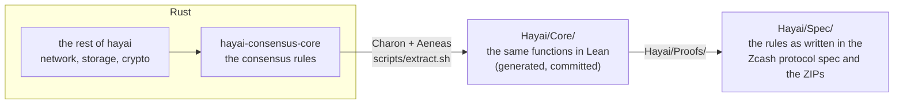
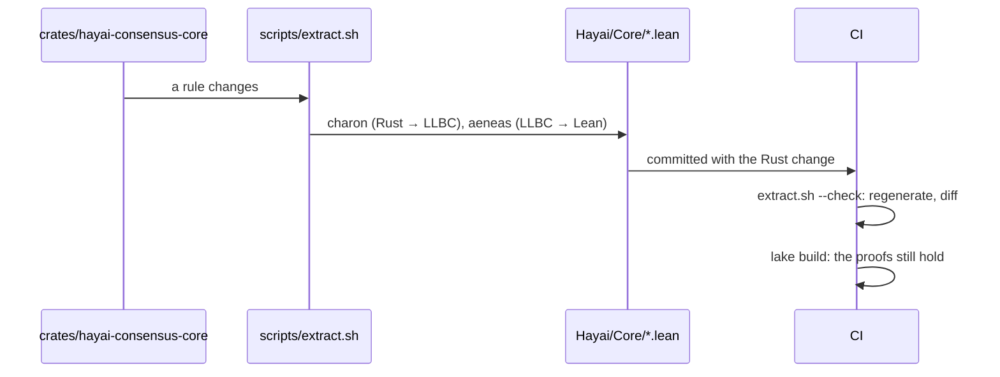

# Formal verification of the hayai consensus core

hayai checks Zcash blocks. The rules that decide whether a block is valid live in one
Rust crate, `hayai-consensus-core`. This directory holds the machine-checked proofs about
that crate: a Lean 4 project that any reader can build.

## What is verified today



| Stage | Content | State |
|---|---|---|
| A | The whole core translates to Lean; CI regenerates the translation and fails on drift; `lake build` checks it | done |
| B | Lean spec of the header and difficulty rules (§7.6, §7.7) and the proofs that the translation satisfies it | in progress |
| C | The other areas of the core: subsidy and funding streams, lockbox, NSM, coinbase value | open |
| D | The contextual block rules move into the core (`hayai-state/src/check.rs`) and get the same treatment | open |

The translation is exact: Aeneas turns each Rust function into a Lean function with the
same control flow, where every arithmetic operation can fail on overflow and every
index can fail out of bounds, as in Rust. A proof about the Lean function is a proof
about the Rust function, up to the trusted base below.

Rule by rule, `PROGRESS.md` says which rule of `docs/consensus.md` is proven, which has its
code in the core but no proof yet, and which is outside the core. `scripts/progress.py`
generates it from `proven.tsv`, and checks with Lean that each theorem listed there exists and
uses no `sorry`; CI fails when the file is stale.

## Check the proofs

```
curl https://elan.lean-lang.org/elan-init.sh -sSf | sh   # once: the Lean toolchain manager
cd formal
lake exe cache get                                      # once: the compiled Mathlib
lake build
```

`lake build` fetches the Lean version of `lean-toolchain` and the Aeneas library of the
`lakefile.lean`, and checks every file under `Hayai/`. Nothing else is needed: the
translation of the Rust code is committed, so a reader does not run Charon or Aeneas.

## How a change to the core reaches the proofs



A change to a rule that the proofs cover breaks a proof; the proof is updated with the
rule, like a test.

## Layout

| Path | Content |
|---|---|
| `Hayai/Core/Types.lean`, `Funs.lean` | The translation of `hayai-consensus-core`. Generated: never edited by hand. |
| `Hayai/Core/FunsExternal_Template.lean` | Generated: the standard-library items the translation needs and the Aeneas library has no model of. |
| `Hayai/Core/FunsExternal.lean` | Hand-written: the definitions of those items (integer conversions, `checked_shr`, `Option` methods). The hash and formatting methods stay axioms: no rule reads them. |
| `Hayai/Spec/` | The specification: one file per section of the protocol specification or ZIP, written from the documents, not from the code. |
| `Hayai/Proofs/` | The bridge proofs: for each function of the core, the translation satisfies the specification. |
| `Hayai/Spec/Difficulty.lean`, `Header.lean` | §7.6 and §7.7: `ToTarget`, `ToCompact`, `MeanTarget`, `MedianTime`, `ActualTimespanBounded`, `Threshold`, `ThresholdBits`, the work, and the header rules. |
| `Hayai/Proofs/Scalars.lean`, `Uint256.lean`, `Header.lean` | Facts about the scalar operations, the 256-bit arithmetic of the core, and the header rules. |
| `proven.tsv` | For each proven rule of `docs/consensus.md`: its section, its text and the theorems that prove it. |
| `PROGRESS.md` | Generated by `scripts/progress.py`: the status of every rule. |
| `scripts/extract.sh` | Regenerates `Hayai/Core/`. `--check` diffs against the committed files (the CI job `formal-extract`). |
| `TOOLCHAIN` | The commits of Aeneas and Charon that generated `Hayai/Core/`, and the Lean version. |

## Trusted base

- The Lean kernel, the Rust compiler, Charon and Aeneas.
- `FunsExternal.lean`: 12 definitions and 17 axioms, listed above.
- The cryptography, the script interpreter and the transaction parser are outside the
  core: the core receives their verdicts as data. `docs/formal-verification.md` has the
  full statement of the guarantee and the plan.

## The Rust subset

Aeneas translates a subset of Rust. The core stays inside it, and the CI job tells when
it leaves it. The forms that matter (the rest is ordinary Rust):

- Tables are owned (`Vec`), not `&'static` slices inside structs; a struct holds no
  reference.
- A function takes its context by value when it is `Copy` (`ParentChain`), and returns
  a table entry by value (`rules_at`), not as a `&'static` borrow.
- A loop has no early `return` and no `?`: a failure goes into a variable and `break`s,
  and the function returns it after the loop.
- An `Option` read from an array is copied into a local before `if let`.
- A module has no name that a local variable would have (`chain_spec`, not `spec`): the
  Lean namespace of the module and the variable would collide.

## Regenerate the translation

Only a change of `crates/hayai-consensus-core` needs it. With Nix:

```
nix build "github:AeneasVerif/aeneas/$(sed -n 's/^aeneas //p' formal/TOOLCHAIN)#aeneas" -o aeneas-bin
PATH=$PWD/aeneas-bin/bin:$PATH formal/scripts/extract.sh
```

From source:

```
git clone https://github.com/AeneasVerif/aeneas && cd aeneas
git checkout "$(sed -n 's/^aeneas //p' ../hayai/formal/TOOLCHAIN)"
make setup-charon          # clones and builds Charon at the pinned commit (rustup nightly)
opam install . --deps-only # or the list in the Aeneas README
make
export PATH=$PWD/bin:$PWD/charon/bin:$PATH
cd ../hayai && formal/scripts/extract.sh
```

On macOS use GNU make (`brew install make`, then `gmake`).
